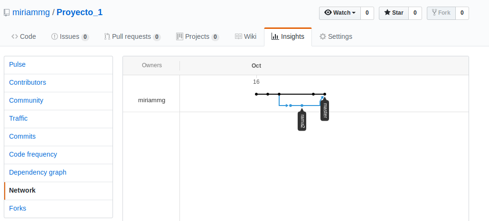

# Proyecto 1 
## Miriam GitHub

## Paso 1 - Crear repositorio
Creación carpeta en documetos (local ordenador)   
    también se puede a través de:   
      $ git mkdir ______   
Iniciar el repositorio de esa carpeta (estando en la carpeta)   
$ git init   

## Paso 2 - Crear archivos 
Crear el archivo readme.md desde visual code   
$ code /.Proyecto_1   

## Paso 3 - Guardar cambios
Añadir y guardar los cambios en el terminal   
$ git status             *(comprobar los cambios que faltan por guardado)*   
$ git add readme.md       
$git commit-am readme.md   

## Paso 4 - Enlazar terminal con github
Enlazar git en el terminal con github   
Crear repositorio en github   
$ git remote add origin https://github.com/miriammg/Proyecto_1.git   
$ git push -u origin master   

## Paso 5 - Creación branch
Crear una nueva branch "rama2"   
$ git checkout -b rama2   

## Paso 6 - Modificaciones en branch
Realizar modificaciones a traves de visual code    
*modificar lineas de readme.md (ya escritas) **important**     
*crear una nueva carpeta   
*..   
$ git code ./___   
    *cambios*    
$ git status   
$ git add _____         (todos archivos)     
$ git commit "   "   

## Paso 7 - Subir a Github
Subir todo a github   
$ git push origin _____ (NOMBRE DE LA RAMA EN LA QUE ESTAS)   

## Paso 8 
Volver a rama master   
$ git checkout ____   

## Paso 9 - Merge
Hacer merge    
$ git merge _____ (rama que deseas importar (no exportar))   

## Paso 10 - Conflito y resolución
Conflicto -   
Conflicto en readme.md    
Abrir readme.md con visual code   
$ cat readme.md    
Modificar en visual code (muy fácil opciones)   

## Paso 11 - GUARDAR 
Guardar los cambios realizados en visual code
$ git status   
$ git add   
$ git commit -am ""    
$ git push origin master   **important**   

